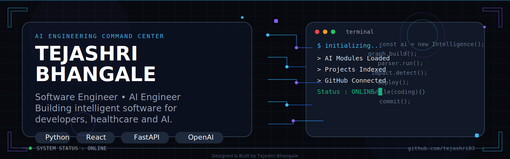
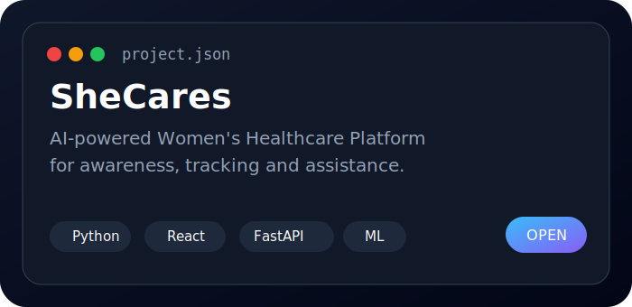
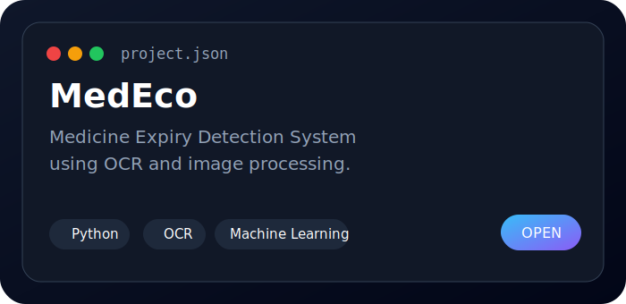
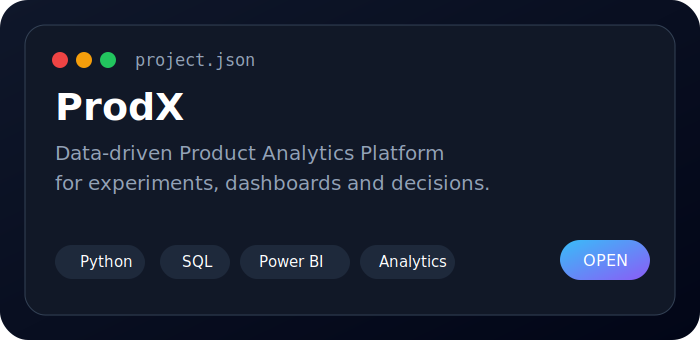
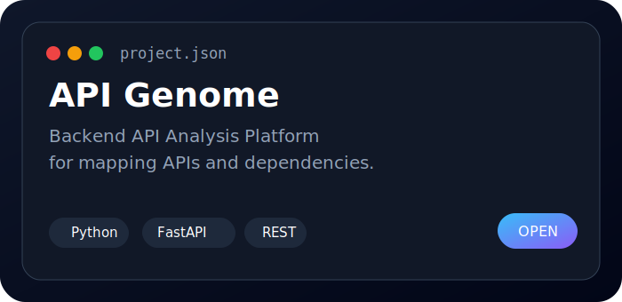
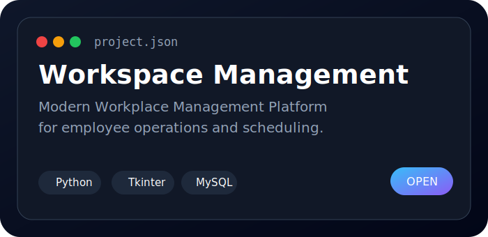

<p align="center">
  
</p>

<h1 align="center">
  <span style="color:#E2E8F0;">Hi 👋 I'm Tejashri Bhangale</span>
</h1>

<h3 align="center">
  <span style="color:#94A3B8;">Software Engineer • AI Engineer • Full Stack Developer</span>
</h3>

<p align="center">
  <span style="color:#94A3B8;">Building intelligent software, developer tools, AI products and scalable web applications.</span>
</p>

<p align="center">
  <a href="https://github.com/tejashri03">
    
  </a>
  <a href="https://www.linkedin.com/in/tejashri-bhangale-657a65289">
    
  </a>
  <a href="mailto:bhangaletejashri325@gmail.com">
    
  </a>
</p>

---

## SYSTEM STATUS

```text
┌──────────────────────────────┐
│ Status      : Online         │
│ Role        : Software Eng.  │
│ Focus       : AI / Backend   │
│ Stack       : Full Stack Dev  │
│ Location    : Navi Mumbai    │
│ College     : Terna College   │
│ Graduation  : 2027           │
└──────────────────────────────┘
```

---

## ABOUT

```python
class Tejashri:
    def __init__(self):
        self.role = "Software Engineer"
        self.mission = "Build products that solve real problems."
        self.languages = ["Python", "Java", "JavaScript", "TypeScript", "SQL"]
        self.backend = ["FastAPI", "Flask", "Node.js"]
        self.frontend = ["React", "Next.js", "HTML", "CSS", "Tailwind"]
        self.ai = ["Machine Learning", "LLMs", "OpenAI API", "Prompt Engineering"]
        self.interests = ["Developer Tools", "Healthcare AI", "Automation", "System Design"]
```

---

## CURRENT FOCUS

- Building AI products with practical impact.
- Improving backend architecture and system design.
- Exploring LLM applications and automation.
- Strengthening DSA and placement preparation.
- Contributing to open source when possible.

---

## TECH STACK

<p align="center">
  
  
  
  
  
</p>

<p align="center">
  
  
  
  
  
  
</p>

---

## FEATURED BUILDS

<p align="center">
  
  
</p>

<p align="center">
  
  
</p>

<p align="center">
  
  
</p>

---

## DASHBOARD

<p align="center">
  
  
</p>

<p align="center">
  
</p>

---

## BUILD LOOP

```cpp
while(true)
{
    Learn();
    Build();
    Improve();
    Share();
    Repeat();
}
```

---

## CONTACT

<p align="center">
  <a href="mailto:bhangaletejashri325@gmail.com">
    
  </a>
  <a href="https://www.linkedin.com/in/tejashri-bhangale-657a65289">
    
  </a>
  <a href="https://github.com/tejashri03">
    
  </a>
</p>

---

<p align="center">
  <strong style="color:#CBD5E1;">Build software that creates impact.</strong>
</p>
